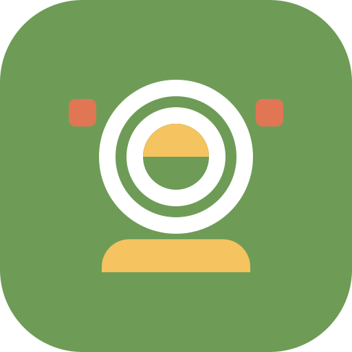

# Airfryer Recipes App

A comprehensive Flutter-based Airfryer Recipe mobile app with modern UI, recipe management, and meal planning features.



## Features

- **Recipe Browsing**: Browse through a collection of airfryer recipes with search and filtering capabilities
- **Recipe Details**: View detailed recipe information including ingredients, instructions, and nutritional facts
- **Favorites System**: Save favorite recipes for quick access
- **Meal Planning**: Plan meals for the week and generate grocery lists
- **Custom Recipes**: Add your own recipes to the app
- **Modern UI**: Clean and intuitive user interface with both light and dark themes
- **Offline Access**: Access all recipes without an internet connection

## Web Demo

The app includes a standalone web demo that showcases the design and UI of the application. You can access it through the Replit preview window.

## Mobile App

The main application is built with Flutter for both Android and iOS platforms.

### Building Android Release APK

To build a release version of the app for Android:

1. See the detailed instructions in [Release Build Guide](docs/release_build_guide.md)
2. Or run the automated build script:
   ```bash
   ./build_android_release.sh
   ```

## Project Structure

```
├── android/                # Android native code and configuration
├── assets/                 # App assets (images, icons, animations)
├── docs/                   # Documentation
├── ios/                    # iOS native code and configuration (not fully configured)
├── lib/                    # Flutter Dart code
│   ├── data/               # Data sources and sample data
│   ├── models/             # Data models
│   ├── providers/          # State management
│   ├── screens/            # App screens
│   ├── services/           # Business logic services
│   ├── utils/              # Utility functions and constants
│   ├── widgets/            # Reusable UI components
│   ├── app_theme.dart      # Theme configuration
│   └── main.dart           # App entry point
├── test/                   # Unit and widget tests
└── web/                    # Web-specific code and assets
```

## Development Setup

### Prerequisites

- Flutter SDK (latest stable version)
- Android Studio or VS Code with Flutter extensions
- For iOS: Xcode (on macOS)

### Getting Started

1. Clone this repository
2. Install dependencies:
   ```bash
   flutter pub get
   ```
3. Run the app:
   ```bash
   flutter run
   ```

## License

This project is licensed under the MIT License - see the LICENSE file for details."# step" 
